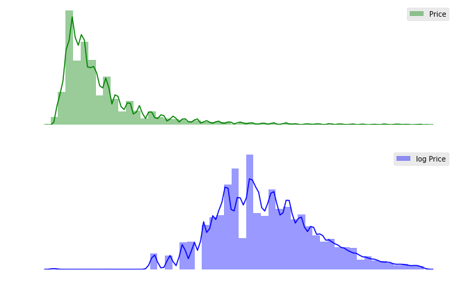
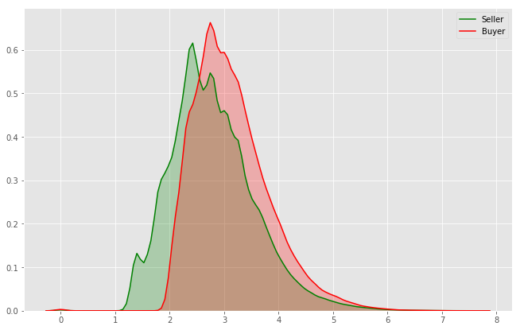
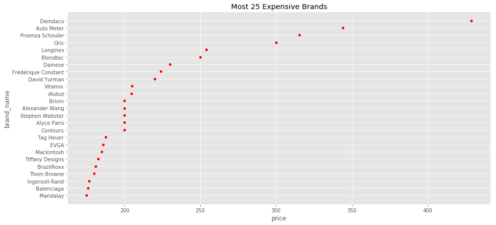
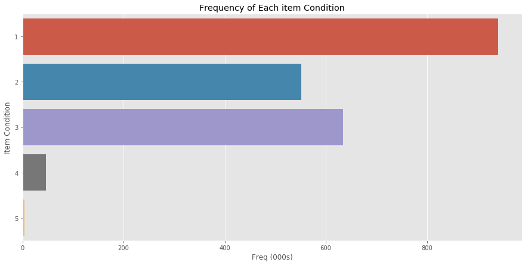
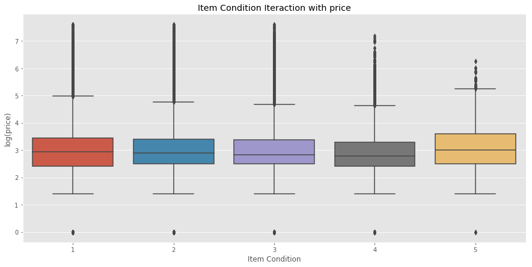
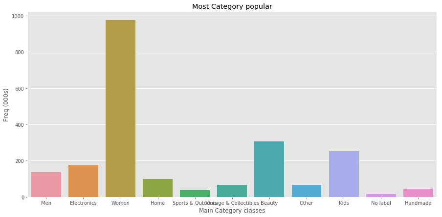

# Mercari
Applied NLP techniques to get more insights and patterns for products features. Suggesting prices for various products, where prices vary according to brand, season, and other factors

**Data Description**
****
- **price** : (**Target Variable**) : float variable, should be predicted.
- **brand** :  name : String Value, brand of each product.
- **category** :  name: String Value, Consists of **3 parts** Main Category and 2 other sub-c**ategories**(will be examined further).
- **item** :  condition id : int value, where id = 1 means product is in best Condition, greater value low condition.
- **item** :  description : String value, the description of product (the bulk in our problem).
- **name** :  : String value, the Name of the product.
- **shipping** :  : boolean value(dummy variable), `shipping = 1` means seller pay the shipping fees `shipping = 0` buyer who pay such fees.

### Price (Target Variable)

we see how price is right skewed,  which induce  **Log transformation**.

### shipping
Determine whether seller payed the shipping fees, or the buyer who payed

So apparently items which `buyer` pay their **shipping fees**, are **more Expensive**

### brands
We have got **+5K brand**

So **Demdaco** is the most Expensive Brand with over **400 £** which could be treated as **Outlier** according to other brands.   May **`brand`** considered as an important feature to our model.

### item Condition
items are ordered Feature, ranges from [1,5], where  **1 value** means item is in its **Best condition** and **5 value** is **Worst**

Here we see how `price` varies with `item condition` 

### Item Category
`df.category_name.head()`
`
0                                    Men/Tops/T-shirts
1    Electronics/Computers & Tablets/Components & P...
2                          Women/Tops & Blouses/Blouse
3                   Home/Home Décor/Home Décor Accents
4                              Women/Jewelry/Necklaces  
`

We Split the item category column into **3 categories** based on the `\` symbol
`
def split_categ(c):
        try:
            c1, c2, c3 = c.split("/")
            return c1, c2, c3
        except:
            return ("No label","No label","No label")
`

Then assign **3 extra features** to our main dataframe

`df['cat1'], df['cat2'], df['cat3']= zip(*df.category_name.apply(split_categ))`

Visualizing the main category **Frequency plot**

**Women** are the most ones making shopping after all...

## Modeling
We are going to get all our explored **features** in a **single compressed matrix** and input it to **Ridge Regression model**

Brand name  
`brand_lv = LabelBinarizer(sparse_output=True)
X_brand  = brand_lv.fit_transform(df['brand_name'])`

Product name  
`name_cv = CountVectorizer(min_df=MIN_NAME_DF)
X_name  = name_cv.fit_transform(df['name']) `

Main Category  
`cat1_cv = CountVectorizer()
X_cat1  = cat1_cv.fit_transform(df['cat1'])`

Sub Category     
`cat2_cv = CountVectorizer()
X_cat2  = cat2_cv.fit_transform(df['cat2'])`

Shipping and condition of items  
`X_dummies = scipy.sparse.csr_matrix( pd.get_dummies(df[['shipping', 'item_condition_id']], sparse=True).values)`

append all scaled and manipulated features into single feature  
`X = scipy.sparse.hstack((
                        X_dummies,
                        X_desc,
                        X_name,
                        X_brand,
                        X_cat1,
                        X_cat2
                        )).tocsr()`

**Train the model** 

`model = Ridge(solver='lsqr', fit_intercept=False)
model.fit(X_train, y_train)`
